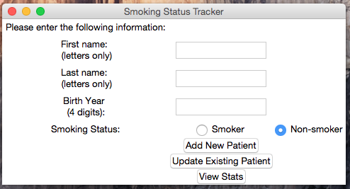
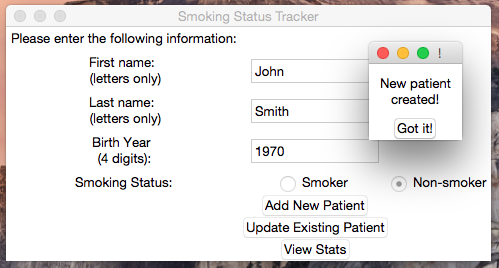
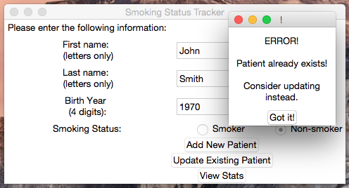
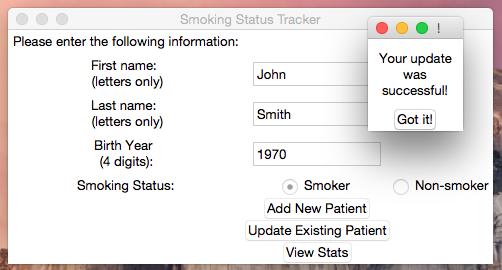
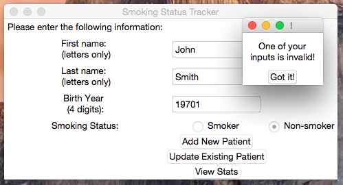

# Smoking Status Tracker - Manual Entry (Desktop Application)
While I worked for a family health team, there was an initiative to update every patient's smoking status. Healthcare providers were originally manually tallying the results. So, I created a desktop application that allowed them to track the results.

While the original project relied on the electronic medical records, this project allows a hypothetical healthcare provider to manually enter (and update) each patient's smoking status and view the statistics on the data they entered.

The user is notified when they successfully store a new patient's information.

They are also alerted when they try to store the same patient twice and are encouraged to update the existing information instead.

The user is notified when they successfully update an existing patient's information. Below, a patient's smoking status is updated from non-smoker to smoker:

There is user input handling. The first and last name must be all letters. The birth year must be all numbers and must be exactly 4 digits long. If any of these conditions are not met, an error message is shown. For example:

