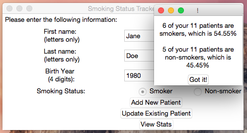

# Smoking Status Tracker - Manual Entry (Desktop Application)
When I worked for a family health team, there was an initiative to update every patient's smoking status. Healthcare providers were originally manually tallying the results. So, I created a desktop application to do this.

While the original project relied on the electronic medical records, this new project allows a hypothetical healthcare provider to manually enter each patient's smoking status and view the statistics on the data they entered:

*Note: Many patients share the same name as one of their parents (who is also a patient), so the birth year is used to distinguish between them.

The user is notified when they successfully store a new patient's information:

They are also alerted when they try to add a duplicate patient:

The user is notified when they successfully update an existing patient's information. Below, John Smith's smoking status is updated from 'non-smoker' to 'smoker':

There is user input handling. The first and last name must be all letters (and cannot be left empty). The birth year must be all numbers and must be exactly 4 digits long. If any of these conditions are not met, an error message is shown. For example:

At any time, the user can view the results:

